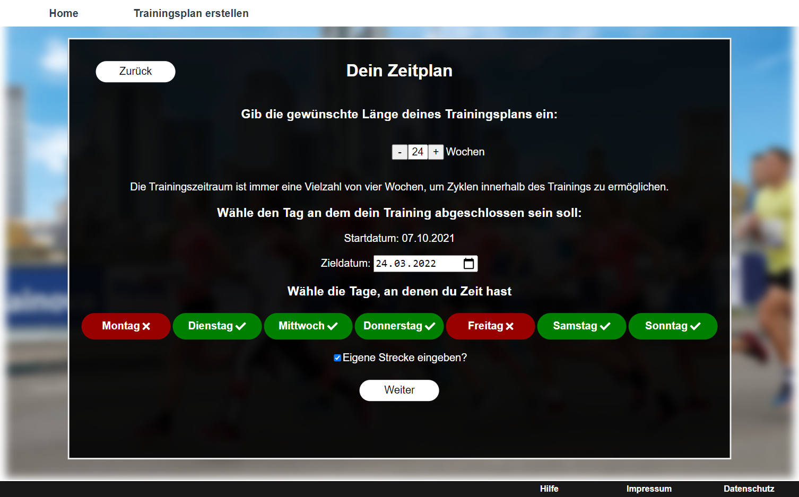

# BachelorThesis


Example image taken out of the users input process.

## Author

- [Tobias Pitsch](https://github.com/RunningSmooth)

## Description

This is my bachelor thesis with the topic:

"Designing and implementation of a website, which generates training plans and displays them with extra information."

During a period of three months I planned and created a website for training plans. It was just the frontend. The backend was not part of the project.

This is a remastered version. This means that I changed the folder structure, recreated the server-side, deleted unused files and redundant code.

At the moment the whole project is in German as it is my native language. Maybe an Englisch version of the website will be created in the future.

## Used technologies / Frameworks

I use the following technologies / frameworks in my project:

- Vue.js (HTML, CSS, JavaScript)
- Express.js (JavaScript)

## Used 3rd Party Libraries

I use the following 3rd party libraries in my project:

### client
Name | Reason
--- | ---
[@fortawesome/fontawesome-free](https://fontawesome.com/) | Adding Icons.
[@fortawesome/free-brands-svg-icons](https://fontawesome.com/) | Adding Icons.
[jspdf](https://www.npmjs.com/package/jspdf) | Creating PDF's with js.
[jspdf-autotable](https://www.npmjs.com/package/jspdf-autotable/v/2.0.9) | Extend jspdf tables.
[vue-router](https://router.vuejs.org/) | Routing.

### server
Name | Reason
--- | ---
[cors](https://www.npmjs.com/package/cors) | Avoiding cors-errors.
[nodemon](https://www.npmjs.com/package/nodemon) | Helps during development. Restart application when files changed.

## Installation / Run

The following components must be installed locally:

- [nodejs](https://nodejs.org/en/) v14.16.0
- [npm](https://nodejs.org/en/) v6.14.11
- [Vue.js](https://vuejs.org/) v3.2.4

To run the project locally, enter the following in the command line / bash:

```console
$ git clone https://github.com/RunningSmooth/BachelorThesis

# Start server-side (from /BachelorThesis)
$ cd code
$ npm install
$ cd server
$ npm start

# Start client-side (from /BachelorThesis)
$ cd code
$ cd client
$ npm install
$ npm run serve
```
---